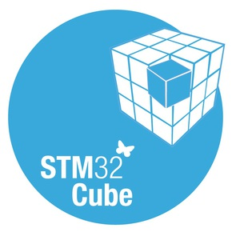

## Hi there 👋

<!--타이틀 부분-->
<li>🛠 Hardware Engineer, RTL Circuit Design </li>
<li>🏫 Hanyang University, Majored Electronics Engineering </li>
<li>📝 My personal blog : <a href="https://jbhdeve.tistory.com" style="color: #add8e6;">https://jbhdeve.tistory.com</a></li>

 

### Languages

  
  
  
  

   

### Microcontroller

  
  
  
  

   

### Currently Developing Tools

  
  
  
  
  

